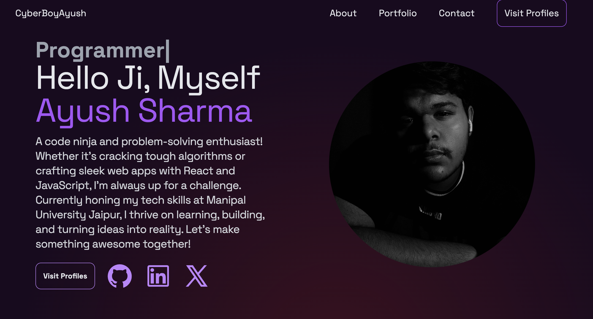

# 🚀 My React Portfolio  

  
[Live Demo](https://cyberboyayush.in)

## 📌 Overview  
This is my personal **React Portfolio** showcasing my skills, projects, and experience. It features smooth scrolling, a gradient cursor animation, a responsive navbar, and a beautifully designed UI using **Tailwind CSS**.

## 🌟 Features  
✅ **Responsive Design** – Works on all screen sizes.  
✅ **Animated Cursor** – A gradient animated cursor effect.  
✅ **Smooth Scroll Navigation** – Scrolls to sections smoothly.  
✅ **Dark Mode Toggle** – Light and Dark mode support.  
✅ **Optimized Performance** – Built with modern React best practices.  

---

## 🛠️ Tech Stack & Tools  

| Tech | Description |
|------|------------|
| **Vite + React** | Fast frontend framework |
| **Tailwind CSS** | Styling Framework |
| **Framer Motion** | Smooth Animations |
| **React Scroll** | Section Navigation |
| **React Icons** | Icons for UI |
| **React Custom Scrollbars** | Custom Scrollbars |

---

## 📂 Folder Structure  
```
📦 react-portfolio
┣ 📂 public
┃ ┗ 📜 favicon.ico
┣ 📂 src
┃ ┣ 📂 components
┃ ┃ ┣ 📜 Navbar.jsx
┃ ┃ ┣ 📜 Hero.jsx
┃ ┃ ┣ 📜 Skills.jsx
┃ ┃ ┣ 📜 Portfolio.jsx
┃ ┃ ┣ 📜 Contact.jsx
┃ ┃ ┣ 📜 Footer.jsx
┃ ┃ ┗ 📜 CustomCursor.jsx
┃ ┣ 📜 App.jsx
┃ ┣ 📜 main.jsx
┃ ┗ 📜 index.css
┣ 📜 .gitignore
┣ 📜 README.md
┣ 📜 package.json
┣ 📜 vite.config.js
┗ 📜 tailwind.config.js
```

---

## 🚀 Getting Started  

### 1️⃣ Clone the Repository  
```sh
git clone https://github.com/CyberBoyAyush/react-portfolio.git
cd react-portfolio
```

### 2️⃣ Install Dependencies
```sh
npm install
```

### 3️⃣ Run the Project (Vite)
```sh
npm run dev
```

The project will be available at [http://localhost:5173](http://localhost:5173)

## 📦 Dependencies Installed
```json
"dependencies": {
  "framer-motion": "^10.0.0",
  "react": "^18.2.0",
  "react-custom-scrollbars-2": "^5.0.0",
  "react-icons": "^5.0.0",
  "react-router-dom": "^6.0.0",
  "react-scroll": "^1.8.0"
}
```

## 🛠️ How It Works
- **Navbar** – Responsive navigation using react-scroll
- **Hero Section** – A stunning intro with animations
- **Portfolio Section** – Displays all my projects
- **Custom Cursor** – A gradient animated cursor effect
- **Smooth Scroll** – Implemented with react-scroll

## 🌎 Deployment

To deploy the project, run:
```sh
npm run build
```

Then upload the `dist/` folder to cPanel, Vercel, Netlify, or GitHub Pages.

For Vercel:
```sh
vercel deploy --prod
```

For Netlify:
```sh
netlify deploy --prod
```

## 📬 Contact

- **Portfolio:** [me.cyberboyayush.in](https://me.cyberboyayush.in)
- **GitHub:** [CyberBoyAyush](https://github.com/CyberBoyAyush)
- **Email:** [cseayushsharma@gmail.com](cseayushsharma@gmail.com)

🚀 Feel free to contribute or suggest improvements!
